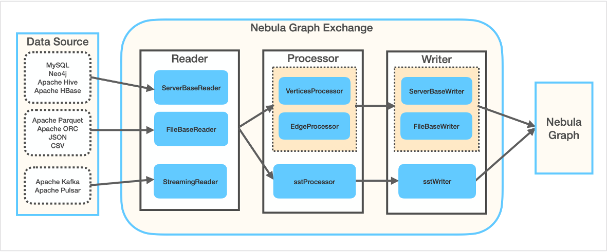

# What is Nebula Exchange

[Nebula Exchange](https://github.com/vesoft-inc/nebula-spark-utils/tree/v2.0.0/nebula-exchange) (Exchange v2.x or Exchange in short) is an Apache Spark&trade; application. It can be used to migrate data from a cluster in a distributed environment to a Nebula Graph v2.x cluster. It supports processing different formats of batch data and streaming data.

Exchange is composed of Reader, Processor, and Writer. Reader reads data of different sources and creates DataFrame. Processor traverses every row of the DataFrame and obtains the values for each column according to the mapping of the `fields` in the configuration file. And then after the specified rows of data to be batch processed are traversed, Writer writes the obtained data into Nebula Graph concurrently. This figure shows how the data is transformed and transferred in Exchange.

## Scenarios

You can use Exchange in these scenarios:

- Converting streaming data from Kafka or Pulsar platforms to vertex or edge data of property graphs and importing them into Nebula Graph. For example, log files, online shopping data, in-game player activities, social networking information, financial trading services, geospatial services, or telemetry data from connected devices or instruments in the data center.

- Converting batch data (such as data in a certain period of time) from a relational database (such as MySQL) or a distributed file system (such as HDFS) into vertex or edge data of property graphs, and importing them into Nebula Graph.

- Converting a large amount of data into SST files and then importing them into Nebula Graph.

## Features

Exchange has these features:

- Adaptable: Exchange supports importing data from different sources into Nebula Graph, which is convenient for you to migrate data.

- SST files supported: Exchange supports converting data from different sources into SST files for data import.
  > **NOTE**: Importing SST files with Exchange v2.x is supported in Linux only.

- Resuming broken transfer: Exchange supports resuming an interrupted transfer from a broken point during the data import process, which saves your time and improves efficiency.
  > **NOTE**: Exchange v2.x supports resuming broken transfer for Neo4j only.

- Asynchronous: Exchange enables you to set an insertion statement for the source and sends it to the Graph Service of Nebula Graph for data insertion.

- Flexible: Exchange supports importing multiple types of vertices  and edges of different sources or formats simultaneously.

- Statistics: Exchange uses the accumulator in Apache Spark&trade; to count the successes and failures during the insertion process.

- Easy to use and user-friendly: Exchange supports HOCON (Human-Optimized Config Object Notation) configuration file format, which is object-oriented, and easy to understand and operate.

## Supported data sources

You can use Exchange 2.0 to convert data of these sources into vertex and edge data and then import them to Nebula Graph:

- Data of different formats stored on HDFS, including:
  - Apache Parquet
  - Apache ORC
  - JSON
  - CSV

- Apache HBase&trade;

- Data warehouses: Hive

- Graph databases: Neo4j 2.4.5-M1.

- Relational databases: MySQL

- Stream processing platforms: Apache Kafka&reg;

- Messaging and streaming platforms: Apache Pulsar 2.4.5
